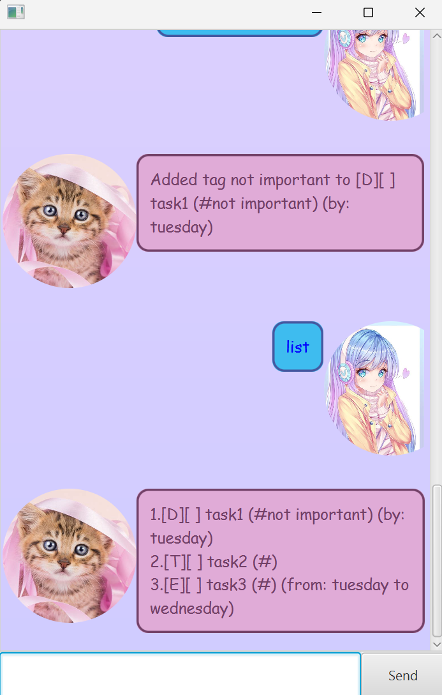

# Danny Chatbot User Guide

Danny is a versatile chatbot for managing your daily tasks.
It is a cute cat that tries its best to help you create, mark, delete
and tag your tasks. It might not be the world's best chatbot,
but it is in contention for the world's cutest chatbot.

- [Quick Start
  ](#quick-start)
- [Features](#features-)
    - [Listing tasks: `list`](#list)
    - [Adding a ToDo: `todo` ](#todo)
    - [Adding a Deadline: `deadline`](#deadline)
    - [Adding an Event: `event`](#event)
    - [Deleting a Task: `delete` ](#delete)
    - [Marking a Task as Done: `mark` ](#mark)
    - [Unmarking a Task: `unmark` ](#unmark)
    - [Tagging a Task: `tag`](#tag)
    - [Finding a Task: `find`](#find)
- [Known Issues](#known-issues)
- [Summary](#summary)

---

## Quick Start

1. Ensure you have Java `17` or above installed in your Computer.

2. Download the latest `.jar` file from [here]().

3. Copy the file to the folder you want to use as the _home folder_ for your chatbot.

4. Open a command terminal, `cd` into the folder you put the jar file in, and use the `java -jar danny.jar` command to
   run the application.

   A GUI similar to the below should appear in a few seconds.
   

5. Type the command in the command box and press Enter to execute it. e.g. typing **`list`** and pressing Enter will
   open the list menu.
   Some example commands you can try:

    - `list` : Lists all contacts.

    - `delete 3` : Deletes the 3rd task shown in the current list.

    - `bye` : Exits the app.

6. Refer to the [Features](#features-) below for details of each command.

---

## Features

- Note: Words in `UPPER_CASE` are the parameters to be supplied by the user.
- Upper casing or lower casing does not matter for commands

### List

Shows list of all current tasks

Format: `list`

### Todo

Adds a ToDo to the task list, a task with a name.

Format: todo TASK_NAME

Examples:

    todo task 1
    todo play games

### Deadline

Adds a deadline to the task list, a task with a name and deadline date.

Format: deadline TASK_NAME /by DEADLINE_DATE

- Note: All dates needs to be in YYYY-MM-DD format, otherwise it will be stored as a string

### Event

Adds an Event to the task list, a task with a name, start date and end date.

Format: `event TASK_NAME /from START_DATE /to END_DATE`

- START_DATE and END_DATE needs to be in YYYY-MM-DD format, otherwise it will be stored as a string

### Delete

Deletes a task from the task list based on list index

Format: delete INDEX

- INDEX is the index of the task to delete. Must be a positive integer (e.g., 1, 2, 3, …).
- If INDEX does not exist within range of task list, error will be shown.
- INDEX is 1-based indexing

Example:

    delete 2

### Mark

Marks a task as completed based on list index

Format: mark INDEX

- INDEX is the index of the task to delete. Must be a positive integer (e.g., 1, 2, 3, …).
- INDEX needs to exist within range of task list, otherwise an error will be shown.

### Unmark

Marks a task as not completed based on list index

Format: unmark INDEX

- INDEX is the index of the task to delete. Must be a positive integer (e.g., 1, 2, 3, …).
- INDEX needs to exist within range of task list, otherwise an error will be shown.

### Tag

Tags a task with a hashtag(#)

Format: tag INDEX DESCRIPTION

- INDEX is the index of the task to delete. Must be a positive integer (e.g., 1, 2, 3, …).
- INDEX needs to exist within range of task list, otherwise an error will be shown.

Example:

    tag 1 cannot be done

### Find

Finds the appropriate task inside the tasklist that has the input as a substring of its description.

Format: find TASK_NAME

Example:

    find task1

---

## Known Issues

- UI Issues: If you expand the window, UI will be messed up.

---

## Summary

| Action                  | Format                                                 | Examples                                               |
|-------------------------|--------------------------------------------------------|--------------------------------------------------------|
| **List all tasks**      | `list`                                                 | `list`                                                 |
| **Add a ToDo**          | `todo TASK_DESCRIPTION`                                | `todo eat some cake`                                   |
| **Add a Deadline**      | `deadline TASK_DESCRIPTION /by DEADLINE_DATE`          | `deadline finish project /by 2024-12-31`               |
| **Add an Event**        | `event TASK_DESCRIPTION /from START_DATE /to END_DATE` | `event birthday party /from 2024-11-01 /to 2024-11-01` |
| **Delete a Task**       | `delete INDEX`                                         | `delete 2`                                             |
| **Mark a Task as Done** | `mark INDEX`                                           | `mark 3`                                               |
| **Unmark a Task**       | `unmark INDEX`                                         | `unmark 3`                                             |
| **Tag a Task**          | `Tag INDEX DESCRIPTION`                                | `update 1 Eat dinner`                                  |
| **Find a Task**         | `find TASK_DESCRIPTION`                                | `find eat`                                             |
